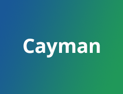

# 本网站基于Cayman主题构建
友情链接：https://github.com/pages-themes/cayman

## The Cayman theme

[Build Status](https://github.com/pages-themes/cayman/actions/workflows/ci.yaml) 

*Cayman is a Jekyll theme for GitHub Pages. You can [preview the theme to see what it looks like](http://pages-themes.github.io/cayman), or even [use it today](#usage).*

